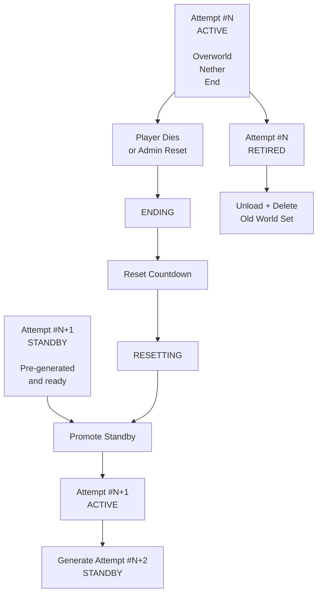
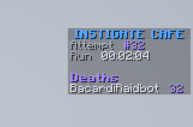
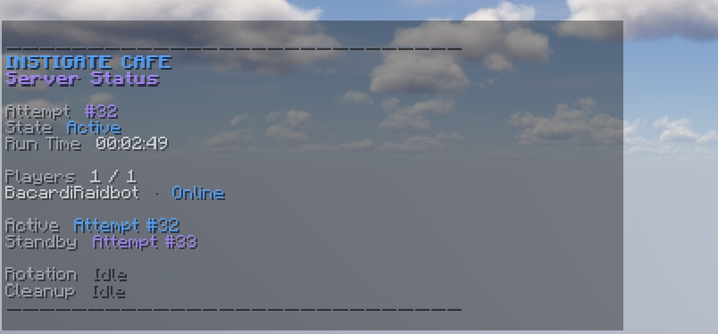
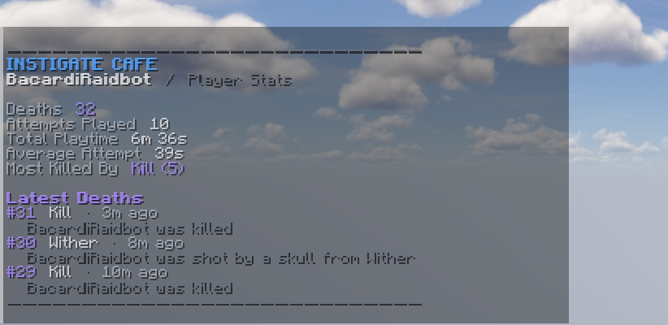
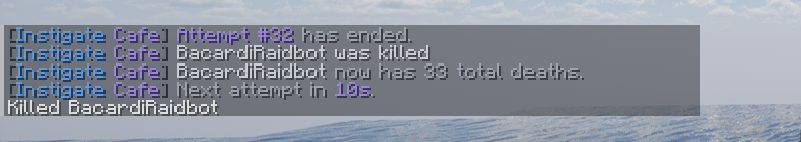
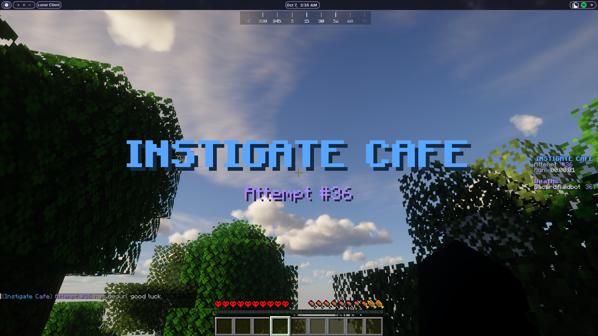

# Minecraft Hardcore Plugin

> Shared hardcore Minecraft for groups of friends.

**Instigate Cafe's Hardcore** is a Paper plugin built around one simple rule:

**If one player dies, the attempt ends for everyone.**

The plugin was originally created for **Instigate Cafe**, a private group of friends playing Minecraft together, but it is designed so that any group can download the `.jar`, install it on a Paper server, and run their own shared hardcore world.

No client mods are required.

---

# How It Works

Every run is treated as an **attempt**.

All players share the same attempt and play normally across the Overworld, Nether, and End.

If any participating player dies:

- the current attempt immediately ends;
- everyone is removed from active gameplay;
- a short reset countdown begins;
- the next world is activated automatically;
- player state is reset;
- the previous attempt is unloaded and removed;
- a new standby world is generated in the background.

The server moves from one attempt to the next without requiring a restart.

## Shared Hardcore

One death ends the run for the entire group.

A death in:

- the Overworld;
- the Nether;
- or the End

will end the current attempt as long as it occurs inside the active hardcore world set.

Player deaths, attempts played, participation, playtime, and other statistics are persisted between server restarts.

---

# World Rotation

Instigate Cafe's Hardcore plugin keeps two world sets available during normal gameplay:

- **ACTIVE** — the world everyone is currently playing.
- **STANDBY** — the next randomly generated attempt, prepared before it is needed.

Each attempt contains its own:

- Overworld
- Nether
- End

The three dimensions belong exclusively to that attempt.



Because the next attempt already exists before the current one ends, players do not need to wait for an entirely new Minecraft world to generate after every death.

A small configurable area around the standby spawn is also preloaded before that world becomes active.

## The Standby World

During Attempt #12, for example:

```text
ACTIVE
Attempt #12
Overworld
Nether
End

STANDBY
Attempt #13
Overworld
Nether
End
```

Attempt #13 already exists while everyone is still playing Attempt #12.

When Attempt #12 ends, the plugin promotes Attempt #13 to `ACTIVE`.

The old Attempt #12 becomes `RETIRED`, is unloaded, and is safely removed.

The plugin then prepares Attempt #14 as the new standby.

```text
Before death:

ACTIVE     → Attempt #12
STANDBY    → Attempt #13


After rotation:

RETIRED    → Attempt #12
ACTIVE     → Attempt #13
STANDBY    → Attempt #14
```

This rotation system is what allows attempts to transition without restarting the server.

---

# Attempts

Attempts are numbered continuously:

```text
Attempt #1
Attempt #2
Attempt #3
...
```

When a new attempt starts, every connected player is transferred into the new active world and becomes a participant in that attempt.

Players who join later are added when they enter the active attempt.

Participation is tracked **per attempt**.

For example:

```text
Attempt #8

Players
4 / 5

Alex       Online
Daniel     Online
Ryan       Online
Claus      Online
Jason      Offline
```

The denominator represents everyone who actually participated in that attempt.

It is **not** a permanent server roster.

If five people participate in an attempt and one disconnects:

```text
Players
4 / 5
```

If another player joins the attempt later:

```text
Players
5 / 6
```

The next attempt starts with its own fresh participant set.

---

# Player Statistics

Instigate Cafe's Hardcore plugin keeps persistent statistics for each player.

Tracked information includes:

- total deaths;
- attempts played;
- total active playtime;
- average playtime per attempt;
- most common death cause;
- recent deaths;
- historical attempt participation.

Playtime only counts while a player is actively participating in an `ACTIVE` hardcore attempt.

Time spent:

- offline;
- in the safety lobby;
- during the reset countdown;
- or outside the active attempt

is not counted as active playtime.

---

# Commands

The primary command is:

```text
/hardcore
```

with the shorter alias:

```text
/hc
```

## Player Commands

| Command | Description |
| --- | --- |
| `/hc` | Open the command overview |
| `/hc help` | Show available commands |
| `/hc status` | Show the current attempt and its participants |
| `/hc stats` | Show your hardcore statistics |
| `/hc stats <player>` | View another player's statistics |
| `/hc deaths` | Show the server death leaderboard |

## Administrative Commands

| Command | Description |
| --- | --- |
| `/hc reset` | Prepare an administrative attempt reset |
| `/hc reset confirm` | Confirm the reset |
| `/hc worlds` | Inspect active, standby, and retired worlds |
| `/hc debug` | Show internal state and integrity diagnostics |

Administrative resets do **not** count as player deaths.

---

# Gallery

## Scoreboard



## Server Status



## Player Statistics



## Attempt End



## New Attempt



---

# Installation

## Requirements

Instigate Hardcore currently targets:

- **Minecraft 26.3**
- **Paper**
- **Java 25**

Other versions are not guaranteed to work unless explicitly supported by a release.

## Install

1. Download the latest `InstigateHardcore.jar`.

2. Place it inside your Paper server's:

```text
plugins/
```

3. Start the server.

4. Stop the server after the plugin creates its configuration files.

5. Review:

```text
plugins/InstigateHardcore/config.yml
```

6. Start the server again.

No client-side installation is required.

Players can connect using vanilla Minecraft or compatible clients such as Lunar Client.

---

# Configuration

The plugin provides configuration for features such as:

```yaml
reset:
  countdown-seconds: 10

scoreboard:
  enabled: true
  update-interval-ticks: 20

worlds:
  lobby-world: world
  preload-radius-chunks: 1

debug:
  enabled: false
```

The configured lobby world acts as a permanent safety world and is **not** part of the rotating hardcore attempts.

---

# World Safety

Instigate Hardcore automatically creates, unloads, and deletes worlds belonging to completed attempts.

Attempt worlds follow names similar to:

```text
attempt_000012_overworld
attempt_000012_nether
attempt_000012_end
```

The permanent lobby world is never treated as an attempt world.

Server operators should still maintain regular backups.

Do not rename an important existing world so that it resembles an Instigate Hardcore attempt world.

---

# Crash Recovery

World rotation state is persisted to disk.

If the server stops during a world transition, Instigate Cafe's Hardcore plugin can recover the active/standby pipeline on the next startup and reconcile the current attempt.

Persistent systems include:

```text
stats.properties
attempt-participants.properties
player-telemetry.yml
world-state.properties
```

These files track:

```text
stats.properties
→ current attempt
→ total deaths
→ latest player names

attempt-participants.properties
→ participants for every attempt
→ first participation time
→ historical attempts played

player-telemetry.yml
→ per-attempt active playtime
→ structured death history
→ death causes
→ latest player names

world-state.properties
→ active attempt
→ standby attempt
→ world seeds
→ rotation state
```

A normal Paper restart does not erase player statistics or attempt history.

---

# Permissions

| Permission | Default | Description |
| --- | --- | --- |
| `instigatehardcore.command` | Everyone | Access normal hardcore commands |
| `instigatehardcore.admin` | Operators | Administrative controls |
| `instigatehardcore.debug` | Operators | Diagnostic information |

---

# Development

Build and run the automated test suite:

```bash
./gradlew clean test
```

Build the plugin:

```bash
./gradlew clean build
```

Run the development Paper server:

```bash
./gradlew runServer
```

Technical documentation is available in:

```text
docs/ARCHITECTURE.md
docs/DEVELOPMENT.md
```

---

# Disclaimer

Instigate Cafe's Hardcore plugin modifies the normal Minecraft world lifecycle.

The plugin can automatically unload and delete completed attempt worlds.

Before using it on a server containing important data:

- make a backup;
- verify your lobby-world configuration;
- test the plugin in a separate environment first.

The project is provided without any guarantee against world corruption, data loss, server incompatibility, or behavior introduced by unsupported Minecraft or Paper versions.