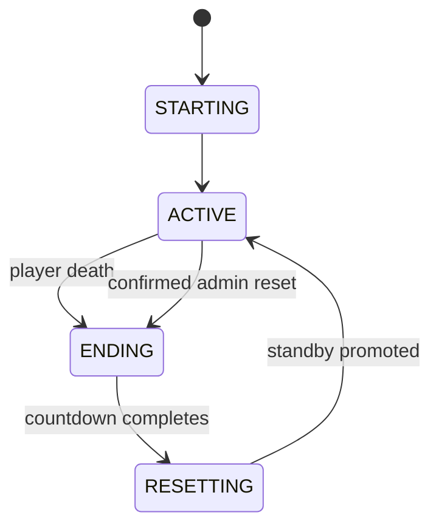
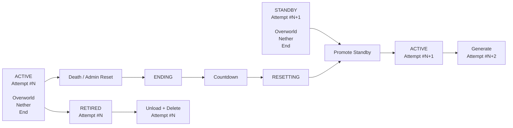
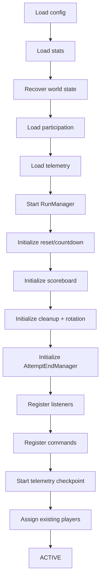

# Architecture

## Overview

**Instigate Hardcore** is a Paper plugin for shared-group hardcore Minecraft.

The core rule is simple:

> If one participating player dies, the current attempt ends for everyone.

The plugin implements that rule with a rotating world pipeline, persistent attempt state, crash recovery, per-player telemetry, participation tracking, and a compact command/diagnostics layer.

It was built for **Instigate Cafe**, but the architecture is intentionally generic so any group can install the plugin and use the same shared-hardcore format.

---

# Design Goals

The plugin is designed around a few constraints:

- one death ends the shared attempt;
- the server should not need to restart between attempts;
- the next attempt should already exist before the current one ends;
- every attempt must have an isolated Overworld, Nether, and End;
- stale worlds must be unloaded and removed safely;
- player inventories and transient state must not leak between attempts;
- participation and player statistics must survive restarts;
- a crash during world rotation must be recoverable;
- no client-side mod should be required.

The architecture therefore separates the system into four broad areas:

1. **Run state**
2. **World lifecycle**
3. **Player lifecycle**
4. **Persistent statistics and diagnostics**

---

# High-Level Lifecycle

Every attempt progresses through a small explicit state machine.



The runtime states are:

| State | Meaning |
| --- | --- |
| `STARTING` | Server/plugin startup is initializing the current run |
| `ACTIVE` | Normal hardcore gameplay |
| `ENDING` | Attempt has ended and the reset countdown is running |
| `RESETTING` | The plugin is rotating to the standby world set |

`RunManager` owns these state transitions and prevents duplicate or invalid transitions.

---

# World Pipeline

Normal operation keeps two attempt world sets available:

- **ACTIVE** — the attempt currently being played;
- **STANDBY** — the next attempt, already created and preloaded.

A recently completed world may temporarily exist as:

- **RETIRED** — the previous active world waiting to be unloaded and deleted.

Each attempt owns three separate worlds:

```text
attempt_000012_overworld
attempt_000012_nether
attempt_000012_end
```

All three dimensions use the same attempt seed.

The permanent lobby is separate from this rotation system.

---

# World Rotation Model



The standby set exists before it is needed.

For example:

```text
Current gameplay:

ACTIVE     Attempt #12
STANDBY    Attempt #13
```

After Attempt #12 ends:

```text
RETIRED    Attempt #12
ACTIVE     Attempt #13
STANDBY    Attempt #14
```

This is the core of the seamless reset model.

---

# Attempt End Flow

A real player death and an administrative reset share the same world lifecycle.

The difference is that only a real death records player death statistics.

```mermaid
sequenceDiagram
    participant Player
    participant Death as DeathListener
    participant End as AttemptEndManager
    participant Run as RunManager
    participant Stats as Stats/Telemetry
    participant Countdown
    participant Rotation as WorldRotationManager

    Player->>Death: dies in ACTIVE world
    Death->>End: endFromPlayerDeath(...)
    End->>Run: ACTIVE -> ENDING
    End->>Stats: end active playtime
    End->>Stats: record death + cause
    End->>Countdown: start reset countdown
    Countdown->>Run: ENDING -> RESETTING
    Countdown->>Rotation: rotateToStandby()
    Rotation->>Rotation: promote STANDBY
    Rotation->>Stats: advance attempt
    Rotation->>Run: RESETTING -> ACTIVE
    Rotation->>Stats: begin new playtime sessions
```

The first valid attempt-ending action wins.

Any later death during the same ending sequence cannot create another attempt transition.

---

# World Persistence and Recovery

World rotation metadata is stored independently from player statistics.

The persistent state records:

```text
version
phase
active attempt
active seed
standby attempt
standby seed
```

The persistent phase is either:

- `STABLE`
- `ROTATING`

Before any player is transferred during rotation, the plugin first persists:

```text
phase=ROTATING
```

This makes the transition recoverable.

If Paper stops during rotation, startup recovery can detect the incomplete transition and complete it deterministically.

## Stable State

```text
ACTIVE     Attempt #20
STANDBY    Attempt #21
phase      STABLE
```

## Incomplete Rotation

```text
ACTIVE     Attempt #20
STANDBY    Attempt #21
phase      ROTATING
```

On recovery, the persisted standby becomes authoritative:

```text
ACTIVE     Attempt #21
STANDBY    Attempt #22
phase      STABLE
```

The statistics attempt number is reconciled when necessary.

---

# World Components

## `WorldSet`

A `WorldSet` represents one complete attempt:

```text
attempt number
seed
Overworld
Nether
End
```

It provides helpers for:

- checking whether a Bukkit `World` belongs to the attempt;
- locating the attempt spawn;
- keeping all three dimensions grouped as one lifecycle unit.

## `WorldSetManager`

Owns the current world references:

```text
lobby
active
standby
retired
```

Responsibilities include:

- world creation;
- loading recovered world sets;
- persisting `ROTATING`;
- promoting standby to active;
- creating the replacement standby;
- validating attempt numbering;
- preloading spawn-area chunks.

## `WorldRotationManager`

Coordinates a successful reset:

1. finalize outgoing telemetry;
2. persist `ROTATING`;
3. ensure the incoming attempt exists in participation history;
4. reset and move all online players;
5. record participation in the new attempt;
6. promote standby;
7. advance persistent attempt statistics;
8. transition the run back to `ACTIVE`;
9. start incoming telemetry sessions;
10. refresh the scoreboard;
11. announce the new attempt;
12. schedule retired-world cleanup;
13. generate the next standby.

## `WorldCleanupManager`

Owns retired-world cleanup.

The cleanup path is:

```text
End
Nether
Overworld
```

Each retired world is unloaded before its directory is deleted.

Deletion runs separately from the gameplay transition so a slow filesystem cleanup does not block the next attempt.

The manager also protects:

- the configured lobby;
- the current active set;
- the current standby set.

---

# Lobby and Safety Model

The configured lobby world is permanent.

It is not:

- part of an attempt;
- deleted during rotation;
- used as the active hardcore world.

The lobby is primarily a safety destination for exceptional situations.

If world rotation cannot complete safely, online players are moved to the lobby and placed in spectator mode instead of being left inside a partially rotated attempt.

---

# Portals and Dimension Isolation

Each attempt has its own Overworld, Nether, and End.

Portal routing is restricted so travel stays inside the active attempt.

```text
ACTIVE Overworld
    ↕
ACTIVE Nether

ACTIVE Overworld
    ↕
ACTIVE End
```

Portal travel involving the lobby, standby worlds, or retired worlds is blocked or redirected.

The End exit returns players to the current active attempt spawn rather than allowing cross-attempt travel.

---

# Player Lifecycle

## Joining

When a player joins during `ACTIVE`:

1. the player is ensured in global stats;
2. the scoreboard is assigned;
3. the player is placed into the current active attempt if necessary;
4. participation is recorded;
5. an active playtime session begins.

If the player is already inside the active world set, the join path is idempotent.

This also corrects stale spectator state after crash recovery.

## Disconnecting

When a player disconnects:

- their current telemetry session is committed;
- their attempt participation remains recorded.

Participation is historical. Disconnecting does not remove a player from the attempt denominator.

## New Attempt

Every online player moved into the promoted standby world is immediately recorded as a participant in the new attempt.

Each attempt therefore has a fresh participant set.

---

# Participation Model

The plugin intentionally does not use a fixed roster.

A participant is:

> A player who actually entered the active attempt.

For an attempt:

```text
4 / 5
```

means:

- 4 participants are currently online in the active world set;
- 5 unique players have participated in that attempt.

If an offline participant reconnects, the denominator does not increase.

If a new player joins mid-attempt, the denominator increases.

Historical participation is retained for statistics such as attempts played.

---

# Player Reset Model

Between attempts, player state is wiped through the Bukkit/Paper API.

The reset includes gameplay state such as:

- inventory;
- armor/offhand;
- ender chest;
- experience;
- health;
- hunger;
- potion effects;
- transient combat state;
- relevant temporary player state.

The plugin does not delete live player `.dat` files.

---

# Persistent Data

Instigate Hardcore maintains four primary persistent stores.

## `stats.properties`

Stores:

```text
current attempt
player UUID
latest player name
total deaths
```

Used for the scoreboard, death leaderboard, and current campaign attempt.

## `attempt-participants.properties`

Stores participation history by attempt:

```text
attempt
player UUID
latest name
first joined timestamp
```

Used for `/hc status`, attempts played, and historical participant counts.

## `player-telemetry.yml`

Stores:

```text
latest player name
playtime by attempt
structured death history
```

Structured death records contain:

```text
attempt
timestamp
cause
vanilla death message
```

Used for total playtime, average attempt playtime, latest deaths, and most common death cause.

## `world-state.properties`

Stores:

```text
rotation phase
active attempt
active seed
standby attempt
standby seed
```

Used for startup world recovery and incomplete-rotation recovery.

---

# Telemetry Sessions

Active playtime is session-based.

A session begins only when:

- the run is `ACTIVE`;
- the player is in the active world set.

A session ends when:

- the player disconnects;
- the attempt ends;
- the server shuts down;
- the player is moved to emergency safety.

Active sessions are checkpointed periodically.

Because the current session itself is memory-only, an unexpected hard process crash can lose only the time since the latest checkpoint rather than the entire session.

---

# Death Handling

`DeathListener` only treats deaths inside the active world set as attempt-ending deaths.

When a valid death occurs:

- vanilla death chat is suppressed;
- drops and experience are suppressed;
- the cause is normalized;
- attempt ending is delegated to `AttemptEndManager`.

The lifecycle manager then records the player's total death, writes structured death telemetry, ends active playtime sessions, announces the attempt end, and starts the countdown.

Administrative resets use the same transition path but do not create a player death record.

---

# User Interface

User-facing styling is centralized through:

```text
InstigateTheme
```

The palette uses:

- azure for primary identity;
- purple for secondary accent;
- light gray for important values;
- gray for labels;
- muted gray for secondary information;
- soft red only for actual errors or dangerous actions.

Ordinary plugin chat messages use:

```text
[Instigate Cafe]
```

Structured views such as `/hc status` and `/hc stats` use a panel-style heading instead of repeating the prefix on every line.

The same theme is shared by commands, attempt lifecycle messages, titles, countdowns, the scoreboard, and errors.

---

# Scoreboard

The sidebar is intentionally compact.

```text
INSTIGATE CAFE

Attempt  #15
Run  01:42:18

Deaths
Sukesan  4
Alex     2
Daniel   1
Ryan     0
```

The scoreboard refreshes on a configurable interval and after attempt rotation.

Paper custom score names are used so visible rows can use Adventure RGB components without showing internal numeric ordering values.

---

# Countdown and New Attempt UI

The reset countdown is rendered in the subtitle layer rather than the large title layer.

Example:

```text
Attempt #15 · Resetting in 8s
```

When the next attempt activates, players receive:

```text
INSTIGATE CAFE
Attempt #15
```

and:

```text
[Instigate Cafe] Attempt #15 has begun. Good luck.
```

---

# Commands and Diagnostics

Public commands:

```text
/hc
/hc help
/hc status
/hc stats
/hc stats <player>
/hc deaths
```

Administrative commands:

```text
/hc reset
/hc reset confirm
/hc worlds
/hc debug
```

`/hc reset` requires a second confirmation command, and that confirmation is tied to the current attempt number.

`/hc debug` performs consistency checks across run state, statistics, world sets, persisted rotation state, countdown, cleanup, and participation.

---

# Startup Sequence



World recovery occurs before normal gameplay systems are registered so the plugin knows which attempt is authoritative before players are processed.

---

# Shutdown Sequence

On normal shutdown:

1. telemetry checkpoint task is cancelled;
2. countdown is cancelled;
3. scoreboard is stopped;
4. active telemetry sessions are committed;
5. statistics are saved;
6. participation data is saved.

The next startup reconstructs runtime-only state from persisted data and loaded worlds.

---

# Package Responsibilities

Typical package layout:

```text
dev.instigatehardcore
├── command
├── core
├── countdown
├── participation
├── player
├── scoreboard
├── stats
├── telemetry
├── ui
└── world
```

The main plugin class primarily performs dependency wiring and lifecycle registration.

Business logic lives in dedicated managers and listeners.

---

# Invariants

The implementation relies on several important invariants:

1. The active world attempt should equal the statistics attempt.
2. Standby should normally equal `active + 1`.
3. An active run should normally have a standby world prepared.
4. Gameplay during `ACTIVE` should have persistent world phase `STABLE`.
5. A player death may end an attempt only once.
6. Administrative reset must never create a player death.
7. Retired worlds must never be treated as active gameplay worlds.
8. The lobby must never be deleted as an attempt world.
9. Participation must be unique per UUID per attempt.
10. Playtime must only accumulate during active participation.

`/hc debug` exists largely to expose these invariants.

---

# Failure Philosophy

When the plugin cannot safely continue a seamless transition, it prefers a recoverable safe state over forcing gameplay forward.

Examples include a missing standby world, attempt mismatch, failed rotation, or invalid persisted state.

The fallback is generally:

```text
stop active gameplay
move online players to lobby
place players in spectator
log the failure
recover on restart
```

---

# Testing Strategy

The automated suite focuses on deterministic state and persistence behavior.

Regression coverage includes:

- participant uniqueness;
- participant persistence;
- rename handling;
- attempts-played semantics;
- empty attempt persistence;
- telemetry death persistence;
- latest-death ordering;
- death-cause aggregation;
- active session handling;
- attempt-specific session closure;
- checkpoint persistence;
- shutdown persistence.

World creation, portal routing, live player transitions, title rendering, scoreboard rendering, and server lifecycle behavior require Paper integration/manual testing.

See [`DEVELOPMENT.md`](DEVELOPMENT.md) for the development workflow.

---

# Related Documentation

- [`../README.md`](../README.md) — public overview and installation
- [`DEVELOPMENT.md`](DEVELOPMENT.md) — local development and testing
- [`ROADMAP.md`](ROADMAP.md) — development status and remaining work
